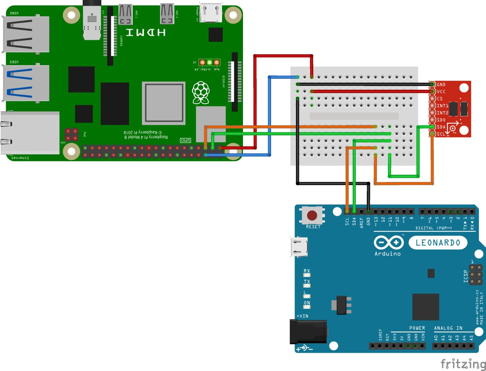

# Wiring



## Bus Layout

```
Raspberry Pi 4          Arduino Leonardo        ADXL345
──────────────          ────────────────        ───────
Pin 3  (SDA) ──────────── Pin 2 (SDA) ────────── SDA
Pin 5  (SCL) ──────────── Pin 3 (SCL) ────────── SCL
Pin 1  (3.3V) ─────────────────────────────────── VCC
Pin 6  (GND) ──────────── GND ─────────────────── GND
```

## Raspberry Pi 4 Pinout (relevant pins)

```
        3.3V  [ 1] [ 2]  5V
   SDA GPIO2  [ 3] [ 4]  5V
   SCL GPIO3  [ 5] [ 6]  GND
              ...
```

## Arduino Leonardo

| RPi           | Leonardo    |
|---------------|-------------|
| Pin 3 (SDA)   | Pin 2 (SDA) |
| Pin 5 (SCL)   | Pin 3 (SCL) |
| Pin 6 (GND)   | GND         |

> Uses dedicated SDA/SCL pins, not A4/A5 like Uno or Nano.

## ADXL345

| RPi           | ADXL345 |
|---------------|---------|
| Pin 3 (SDA)   | SDA     |
| Pin 5 (SCL)   | SCL     |
| Pin 1 (3.3V)  | VCC     |
| Pin 6 (GND)   | GND     |

> CS and SDO handled by onboard resistors on the breakout board.

## Bus Summary

| Device           | I2C Address |
|------------------|-------------|
| Arduino Leonardo | 0x08        |
| ADXL345          | 0x53        |
